# Instalasi Lumen, MongoDB, dan Konfirgurasi App Key

Anas Al Halimi Arif<br />
215150700111036<br />
PEMIN - A<br /><br />

Percobaan instalasi MongoDB.<br />
 
* ## langkah 1
>Buka halaman https://www.mongodb.com/try/download/community dan klik Download <br /><br />

* ## Langkah 2 
> Jalankan mongodb-windows-x86_64-6.0.1-signed.msi <br /><br />

* ## Langkah 3
> Pada welcome screen klik Next <br /><br />
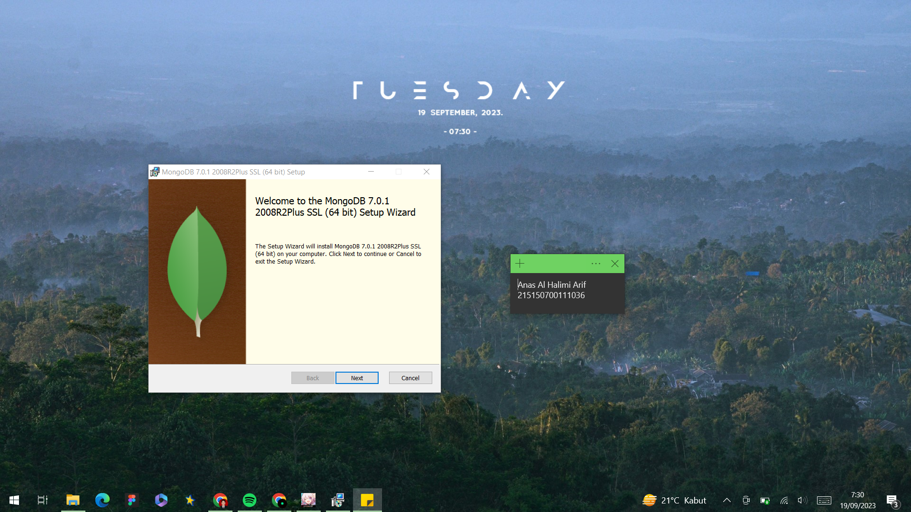

* ## Langkah 4
> Pada bagian End-User License Agreement centang “I accept the terms in the License Agreement” dan klik Next <br /><br />
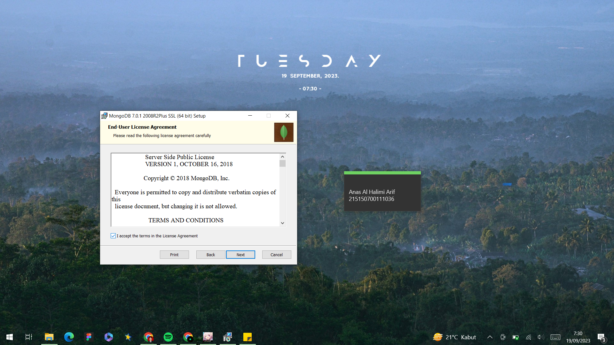

* ## Langkah 5
> Pada bagian Choose Setup Type klik Complete <br /><br />
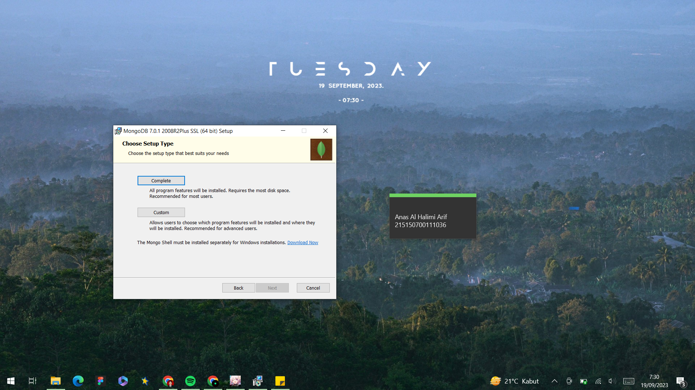

* ## Langkah 6
> Pada bagian Service Configuration tanpa mengubah apapun klik Next <br /><br />
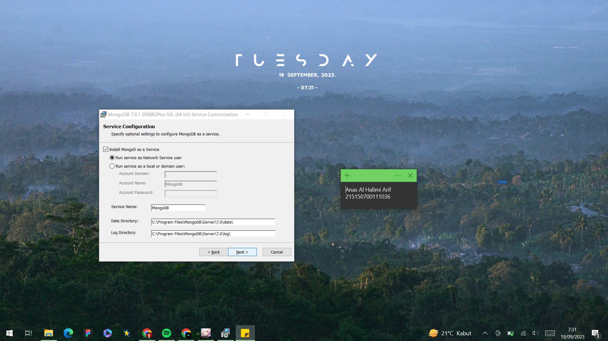

* ## Langkah 7
> Pastikan “Install MongoDB Compass” tercentang <br /><br />
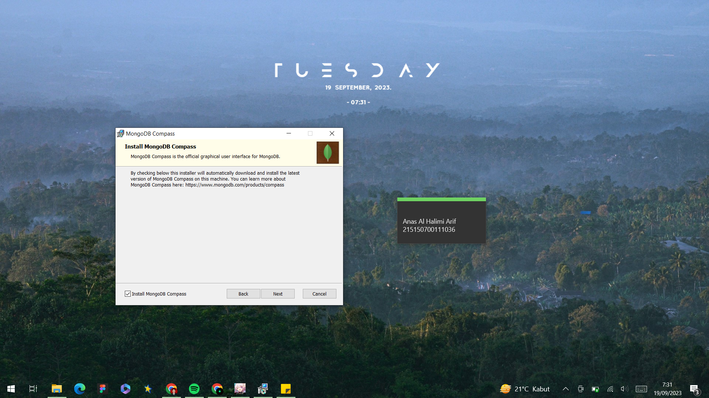 <br /><br />

* ## Langkah 8
> langkah terakhir klik Install <br /><br />
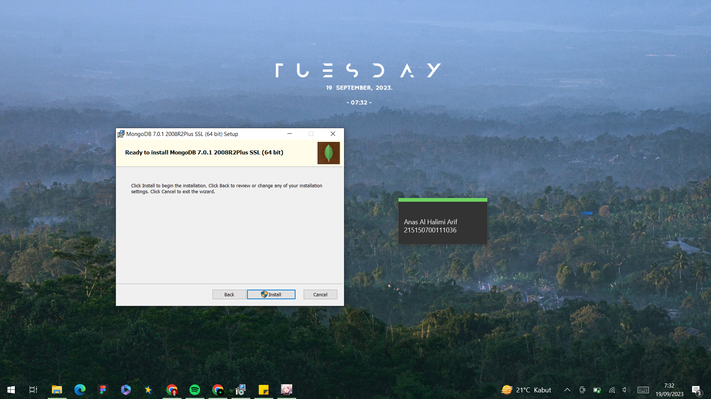 <br /><br />

* ## Langkah 9
> Menunggu proses instal MongoDB <br /><br />
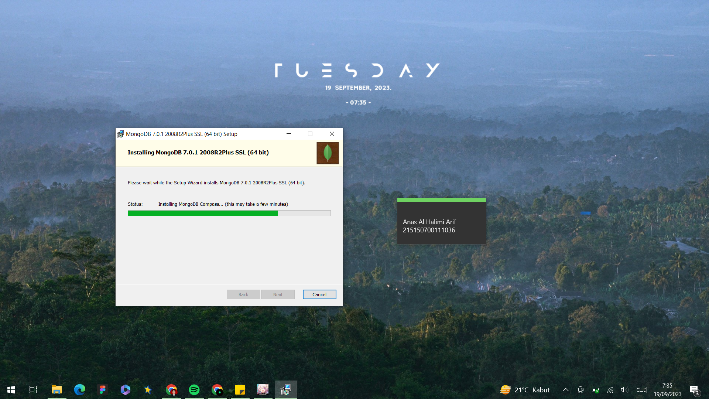 <br /><br />

* ## Langkah 10
> MongoDB Compass akan terbuka secara otomatis <br /><br />
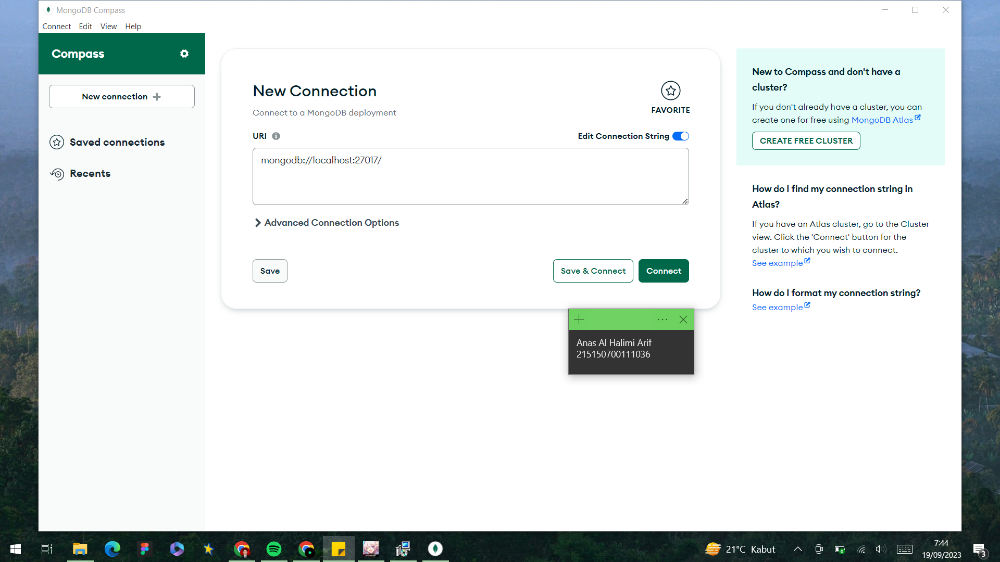 <br /><br />

Percobaan Instalasi Lumen<br />

* ## Langkah 1
> Buka folder yang diinginkan pada file explorer lalu copy path folder tersebut<br /><br />
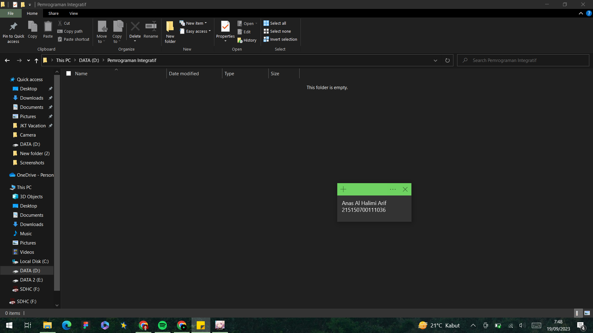 <br /><br />

* ## Langkah 2
> Buka cmd <br /><br />

* ## Langkah 3
> Buka path pada cmd ke folder yang diinginkan dengan command ``` cd (drive folder)\nama folder\... ``` <br /><br />
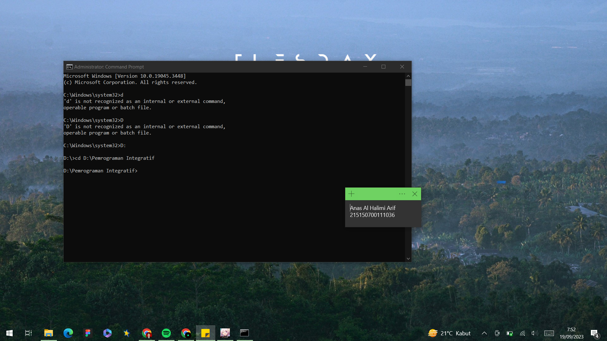 <br /><br />

* ## Langkah 4
> Jalankan command untuk menginstall lumen pada folder tersebut ``` composer create-project --prefer-dist laravel/lumen lumenapi ```<br /><br />
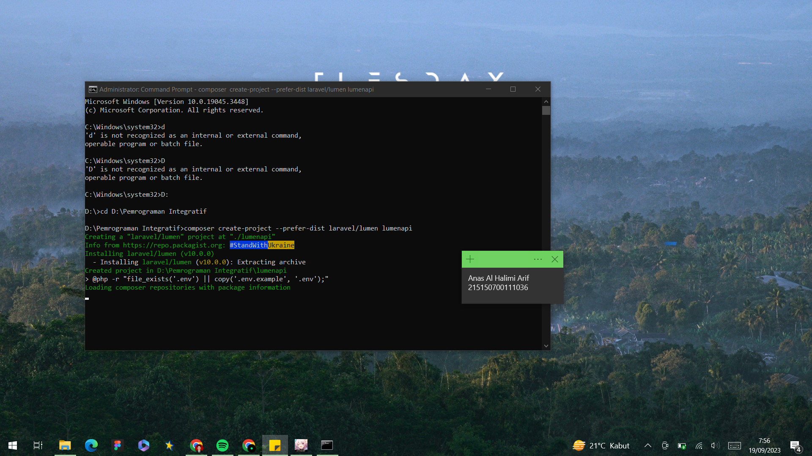 <br /><br />

* ## Langkah 5
> Buka folder projek lumen kita dan jalankan projek kita <br /><br />
> Sebelum menjalankan projek lumen kita, kita perlu membuka folder projek kita pada cmd dengan menggunakan command ``` cd lumenapi ``` <br /><br />
> Kemudian untuk menjalankan server lumen kita dapat menggunakan command berikut, ``` php -S localhost:8000 -t public ``` <br /><br />
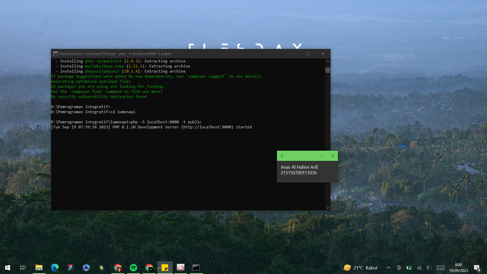 <br /><br />

Konfigurasi APP_KEY<br />

* ## Langkah 1
> Pada aplikasi Laravel atau Lumen kita memerlukan APP_KEY yang nantinya akan berfungsi untuk pengamanan aplikasi kita, jika kita menggunakan laravel kita dapat mengetikkan perintah berikut pada cmd untuk men-generate APP_KEY kita, ```php artisan key:generate ```<br /><br />
> Namun pada Lumen tidak ada fitur demikian, kita harus membuat random string sendiri, terdapat beberapa cara untuk melakukannya,<br /><br />

* ## Langkah 2
> Buka file web.php pada folder routes, kemudian buat endpoint yang akan mengembalikan random string dengan panjang 32 <br /><br />
```use Illuminate\Support\Str; // import library Str``` <br />
```...``` <br />
```$router->get('/key', function () {``` <br />
```return Str::random(32);``` <br />
```});``` <br /><br />
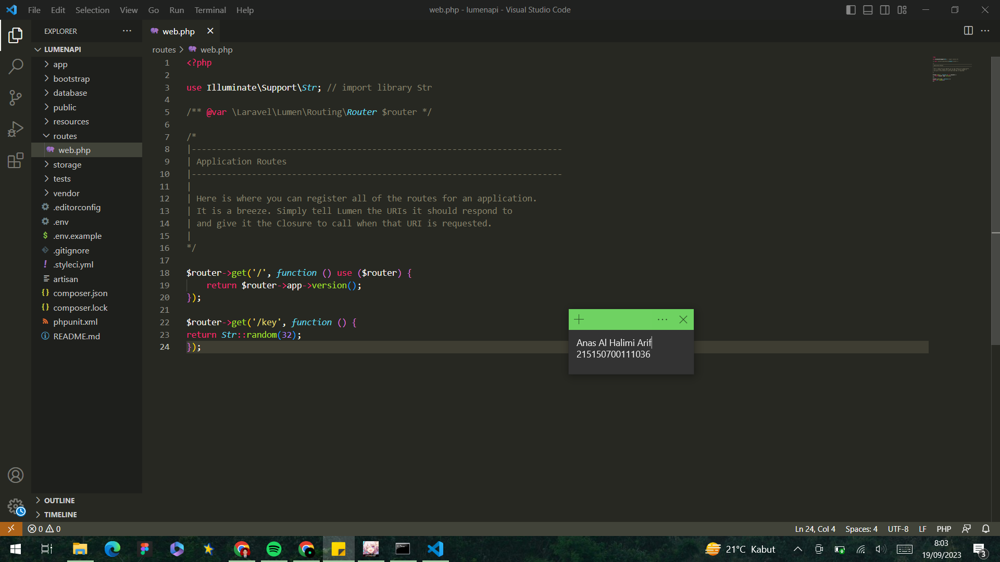 <br /><br />

* ## Langkah 3
> Melakukan generate dari website https://pinetools.com/random-string-generator <br /><br />
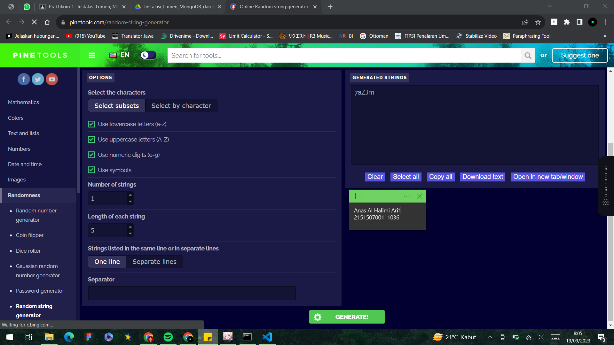 <br /><br />

* ## Langkah 4
> Setelah mendapat random string kita akan memasukkan random string tersebut ke file .env kita pada bagian APP_KEY<br /><br />
```...```<br />
```APP_KEY=<<random_string>> ```<br />
```...```<br /><br />
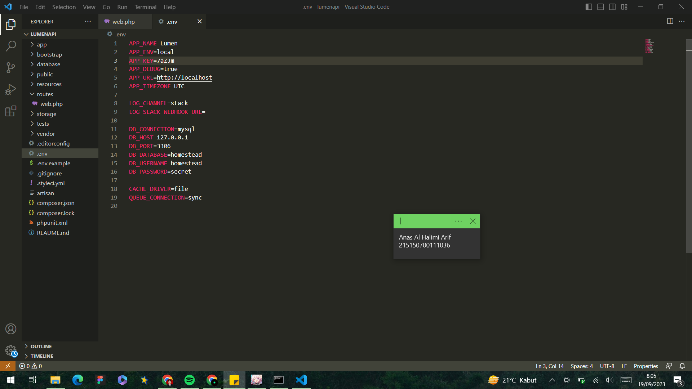 <br /><br />

* ## Langkah 5
> Melakukan testing<br /><br />
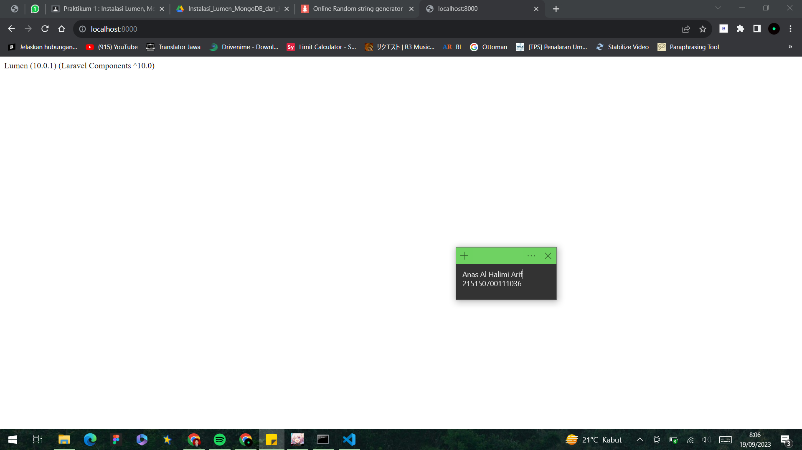 <br /><br />

* ## Langkah 6
> Melakukan testing dengan key<br /><br />
 <br /><br />


