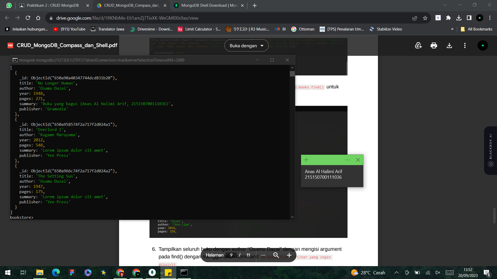
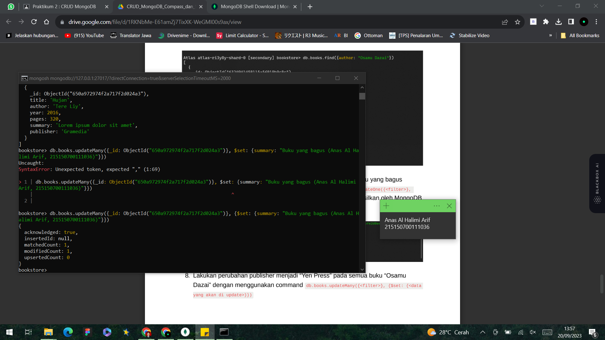

# CRUD MongoDB Compass dan Shell

Anas Al Halimi Arif<br />
215150700111036<br />
PEMIN - A<br /><br />

Percobaan MongoDB Compas.<br />
 
* ## langkah 1
> Lakukan koneksi ke MongoDB menggunakan connection string <br /><br />


* ## Langkah 2 
>  Membuat database baru dengan meng-klik ```"Create Database"```. Disini kita akan membuat database dengan nama "bookstore" dan nama collection "books"<br /><br />


* ## Langkah 3
> Langkah selanjutnya kita mencoba melakukan insert buku pertama dengan melakukan klik ```"Add Data"```, pilih ```"Insert Document"```, isi dengan data yang diinginkan dan klik “Insert”<br /><br />


* ## Langkah 4
> Setelah langkah 3 sudah dilakukan, selanjutnya bisa melakukan insert buku kedua dengan cara yang sama seperti langkah sebelumnya.<br /><br />


* ## Langkah 5
> Setelah selesai melakukan insert sata. Kita mencoba melakukan pencarian buku dengan author “Osamu Dazai” dengan mengisi filter yang diinginkan dan klik ```“Find”```<br /><br />


* ## Langkah 6
> Selanjutnya kita akan melakukan perubahan summary pada buku “No Longer Human” menjadi “Buku yang bagus (<NAMA>,<NIM>) dengan melakukan klik “Edit Document” (berlambang pensil), mengisi nilai summary yang baru, dan melakukan klik “Update”<br /><br />


* ## Langkah 7
> Selanjutnya melakukan penghapusan pada buku “I Am a Cat” dengan melakukan klik ```“Remove Document”``` (berlambang tong sampah) dan melakukan klik “Delete”<br /><br />


Percobaan MongoDB Shell.<br />

* ## Langkah 1
> Hal pertama yang kita lakukan adalah melakukan koneksi ke MongoDB Server dengan menjalankan command mongosh. Tampilan terminal akan menjadi seperti berikut<br /><br />


* ## Langkah 2
> Kemudian kita akan Mencoba melihat list database yang ada di server dengan menjalankan command ```show dbs```<br /><br />
<br /><br />
> Untuk berpindah ke database “bookstore” gunakan command ```use bookstore```, kita dapat memastikan telah berpindah ke database yang benar dengan melihat tulisan sebelum tanda ```“>”```<br /><br />

> untuk melihat collection yang ada pada database tersebut dengan menggunakan command ```show collections```<br /><br />
<br /><br />

* ## Langkah 3
> langkah selanjutnya kita mencoba melakukan insert buku “Overlord I” dengan menggunakan command ```db.books.insertOne(<data kalian>)```, setelah insert buku berhasil maka MongoDB akan mengembalikan pesan sebagai berikut.<br /><br />


* ## Langkah 4
> Selanjutnya kita mencoba melakukan insert buku “The Setting Sun” dan “Hujan” dengan insert many dengan menggunakan command ```db.books.insertMany(<data kalian>)```<br /><br />


* ## Langkah 5
> Selanjutnya kita mencoba melakukan pencarian buku dengan menggunakan command ```db.books.find()``` untuk melakukan pencarian semua buku.<br /><br />


* ## Langkah 6
> Selanjutnya kita mencoba melakukan Tampilkan seluruh buku dengan menggunakan ketentuan author “Osamu Dazai” dengan mengisi argument pada ```find()``` dengan menggunakan command ```db.books.find({<filter yang ingin diisi>})```<br /><br />


* ## Langkah 7
> Selanjutnya kita mencoba melakukan perubahan summary pada buku ```“Hujan”``` menjadi ```“Buku yang bagus (<NAMA>,<NIM>)"``` dengan mengunakan command ```db.books.updateOne({<filter>}, {$set: {<data yang akan di update>}})```<br /><br />


* ## Langkah 8
> Selanjutnya kita mencoba melakukan perubahan publisher menjadi ```“Yen Press”``` pada semua buku ```“Osamu Dazai”``` dengan menggunakan command ```db.books.updateMany({<filter>}, {$set: {<data yang akan di update>}})```<br /><br />


* ## Langkah 9
> Selanjutnya kita mencoba melakukan penghapusan pada buku ```“Overlord I”``` dengan menggunakan command ```db.books.deleteOne({<argument>})```<br /><br />


* ## Langkah 10
> Terakhir kita mencoba melakukan penghapusan pada semua buku ```“Osamu Dazai"``` dengan menggunakan command ```db.books.deleteMany({<argument>})``` <br /><br />
