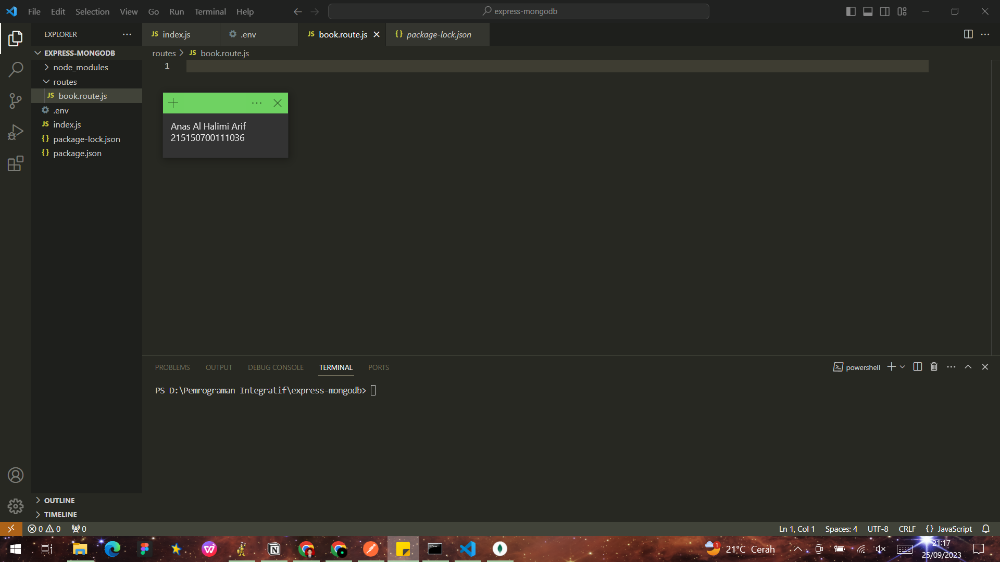

# Integrasi MongoDB dan Express

Anas Al Halimi Arif<br />
215150700111036<br />
PEMIN - A<br /><br />
 
* ## Percobaan Instalasi NodeJS
>- **langkah 1**<br /><br />
>Buka halaman dibawah untuk mengunduh installer nodejs<br />
```Integrasi MongoDB dan Express```<br /><br />
>- **Langkah 2**<br /><br />
>Unduh dan jalankan installer<br /><br />
>- **Langkah 3**<br /><br />
>Setelah instalasi selesai jalankan command ```node -v``` untuk memeriksa apakah NodeJS sudah terinstall<br /><br />


* ## Inisiasi Project Express dan Pemasanan Package
>- **langkah 1**<br /><br />
> Membuat folder dengan nama express-mongodb dan masuk ke dalam folder tersebut lalu buka melalui text editor masing-masing<br /><br />

>- **Langkah 2**<br /><br />
> Setelah memasuki pada text editor masing-masing dengan path folder yang telah dibuat sebelumnya, Lakukan npm init untuk mengenerate file package.Json dengan menggunakan command ```npm init -y```<br /><br />

>- **Langkah 3**<br /><br />
> Lakukan instalasi express, mongoose, dan dotenv dengan menggunakan command ```npm i express mongoose dotenv``` <br /><br />


* ## Koneksi Express ke MongoDB
>- **langkah 1**<br /><br />
> Buatlah file ```index.js``` pada root folder dan masukkan kode di bawah ini <br />
>```JavaScript
>require('dotenv').config();
>const express = require('express');
>const mongoose = require('mongoose');
>const app = express();
>
>app.use(express.json());
>
>app.get('/', (req, res) => {
>    res.status(200).json({
>        message: '<nama>,<nim>'
>    })
>})
>
>>app.listen(PORT, () => {
 >   console.log(`Running on port ${PORT}`);
>})
>```
>
> Setelah itu coba jalankan aplikasi dengan command node ```index.js```<br /><br />
>- **Langkah 2**<br /><br />
> Lakukan pembuatan file ```.env``` dan masukkan baris berikut<br /><br />
>```javascript
>PORT=5000
>```
>
>Setelah itu ubahlah kode pada listening port menjadi berikut dan coba jalankan aplikasi kembali
>```javascript
>...
>const PORT = process.env.PORT || 8000;
>app.listen(PORT, () => {
>    console.log(`Running on port ${PORT}`);
>})
>```
>
>- **Langkah 3**<br /><br />
> Copy connection string yang terdapat pada compas atau atlas dan paste kan pada ```.env``` seperti berikut
>```javascript
>MONGO_URI=<Connection string masing-masing>
>```
>
>- **langkah 4**<br /><br />
> Tambahkan baris kode berikut pada file ```index.js```<br /><br />
>```javascript
>require('dotenv').config();
>const express = require('express');
>const mongoose = require('mongoose');
>
>mongoose.connect(process.env.MONGO_URI);
>const db = mongoose.connection;
>
>db.on('error', (error) => {
>    console.log(error);
>});
>
>db.once('connected', () => {
>   console.log('Mongo connected');
>})
>...
>```
>
>Setelah itu coba jalankan aplikasi kembali<br />
>

* ## Pembuatan Routing
>- **Langkah 1**<br /><br />
> Lakukan pembuatan direktori routes di tingkat yang sama dengan index.js<br /><br />

>- **Langkah 2**<br /><br />
> Buatlah file ```book.route.js``` di dalamnya<br /><br />

>- **langkah 3**<br /><br />
> Tambahkan baris kode berikut untuk fungsi getAllBooks
>```javascript
>const router = require('express').Router();
>
>router.get('/', function getAllBooks(req, res) {
>    res.status(200).json({
>        message: 'mendapatkan semua buku'
>    })
>})
>
>module.exports = router;
>```
>
>- **Langkah 4**<br /><br />
> Lakukan hal yang sama untuk getOneBook, createBook, updateBook, dan deleteBook
>```javascript
>const router = require('express').Router();
>...
>router.get('/', function getAllBooks(req, res) {
>    res.status(200).json({
>        message: 'mendapatkan semua buku'
>    })
>})
>
>module.exports = router;
>
>router.get('/:id', function getOneBook(req, res) {
>    const id = req.params.id;
>    res.status(200).json({
>        message: 'mendapatkan satu buku',
>        id,
>    })
>})
>
>router.post('/', function createBook(req, res) {
>    res.status(200).json({
>        message: 'membuat buku baru'
>    })
>})
>
>router.put('/:id', function updateBook(req, res) {
>    const id = req.params.id;
>    res.status(200).json({
>        message: 'memperbaharui satu buku',
>        id,
>    })
>})
>
>router.delete('/:id', function deleteBook(req, res) {
>    const id = req.params.id;
>    res.status(200).json({
>        message: 'menghapus satu buku',
>        id,
>    })
>})
>
>module.exports = router;
>```
>
>- **Langkah 5**<br /><br />
> Lakukan import book.route.js pada file index.js dan tambahkan baris kode berikut
>```javascript
>require('dotenv').config();
>const express = require('express');
>const mongoose = require('mongoose');
>
>const bookRoutes = require('./routes/book.route'); //
>...
>app.get('/', (req, res) => {
>    res.status(200).json({
>        message: '<nama>,<nim>'
>    })
>})
>app.use('/books', bookRoutes); //
>
>const PORT = process.env.PORT || 8000;
>app.listen(PORT, () => {
>    console.log(`Running on port ${PORT}`);
>})
>```
>
>
>- **langkah 5**<br /><br />
> Uji salah satu endpoint dengan Postman<br />


* ## Pembuatan controller
>- **Langkah 1**<br /><br />
> Lakukan pembuatan direktori controllers di tingkat yang sama dengan index.js<br /><br />

>- **Langkah 2**<br /><br />
> Buatlah file book.controller.js di dalamnya<br /><br />

>- **langkah 3**<br /><br />
> Salin baris kode dari routes untuk fungsi getAllBooks
>```javascript
>const Book = require('../models/book.model');
>
>function getAllBooks(req, res) {
>    res.status(200).json({
>        message: 'mendapatkan semua buku'
>   })
>};
>module.exports = {
>    getAllBooks,
>}
>```
>
>- **Langkah 4**<br /><br />
> Lakukan hal yang sama untuk getOneBook, createBook, updateBook, dan deleteBook
>```javascript
>function getOneBook(req, res) {
>    const id = req.params.id;
>    res.status(200).json({
>        message: 'mendapatkan satu buku',
>        id,
>    })
>}
>function createBook(req, res) {
>    res.status(200).json({
>        message: 'membuat buku baru'
>    })
>}
>function updateBook(req, res) {
>    const id = req.params.id;
>    res.status(200).json({
>        message: 'memperbaharui satu buku',
>        id,
>    })
>}
>function deleteBook(req, res) {
>    const id = req.params.id;
>    res.status(200).json({
>        message: 'menghapus satu buku',
>        id,
>    })
>}
>module.exports = {
>    getAllBooks,
>    getOneBook, //
>    createBook, //
>    updateBook, //
>    deleteBook //
>}
>```
>
>- **Langkah 5**<br /><br />
> Lakukan import book.controller.js pada file book.route.js
>```javascript
>const router = require('express').Router();
>const book = require('../controllers/book.controller'); //
>...
>module.exports = router;
>```
>

>- **langkah 6**<br /><br />
> Lakukan perubahan pada fungsi agar dapat memanggil fungsi dari book.controller.js
>```javascript
>const router = require('express').Router();
>
>const book = require('../controllers/book.controller'); //
>
>router.get('/', book.getAllBooks);
>router.get('/:id', book.getOneBook);
>router.post('/', book.createBook);
>router.put('/:id', book.updateBook);
>router.delete('/:id', book.deleteBook);
>
>module.exports = router;
>```
>
>- **Langkah 7**<br /><br />
> Lakukan pengujian kembali, pastikan response tetap sama<br /><br />


* ## Pembuatan Model
>Berikut adalah gambaran bentuk data dari modul sebelumnya<br /><br />
>
>- **Langkah 1**<br /><br />
> Lakukan pembuatan direktori models di tingkat yang sama dengan index.js<br /><br />

>- **langkah 2**<br /><br />
> Buatlah file book.model.js di dalamnya<br /><br />

>- **Langkah 3**<br /><br />
> Tambahkan baris kode berikut sesuai dengan tabel di atas
>```javascript
>const mongoose = require('mongoose');
>
>const bookSchema = new mongoose.Schema({
>    title: {
>        type: String
>    },
>    author: {
>        type: String
>    },
>    year: {
>        type: Number
>    },
>    pages: {
>        type: Number
>    },
>    summary: {
>        type: String
>    },
>    publisher: {
>        type: String
>    }
>})
>
>module.exports = mongoose.model('book', bookSchema);
>```
>

* ## Operasi CRUD
>- **Langkah 1**<br /><br />
> Hapus semua data pada collection books<br /><br />

>- **Langkah 2**<br /><br />
> Lakukan import book.model.js pada file book.controller.js
>```javascript
>const Book = require('../models/book.model');
>...
>```
>
>- **Langkah 3**<br /><br />
> Lakukan perubahan pada fungsi createBook
>```javascript
>const Book = require('../models/book.model');
>...
>async function createBook(req, res) {
>    const book = new Book({
>    title: req.body.title,
>    author: req.body.author,
>    year: req.body.year,
>    pages: req.body.pages,
>    summary: req.body.summary,
>    publisher: req.body.publisher,
>    })
>    try {
>        const savedBook = await book.save();
>        res.status(200).json({
>            message: 'membuat buku baru',
>            book: savedBook,
>        })
>    } catch (error) {
>    res.status(500).json({
>        message: 'kesalahan pada server',
>        error: error.message,
>        })
>    }
>}
>...
>```
>
>- **Langkah 4**<br /><br />
> Buatlah dua buah buku dengan data di bawah ini dengan Postman
>```javascript
>{
>    "title": "Dilan 1990",
>    "author": "Pidi Baiq",
>    "year": 2014,
>    "pages": 332,
>    "summary": "Mirea, anata wa utsukushī",
>    "publisher": "Pastel Books"
>}
>```
>```javascript
>{
>    "title": "Dilan 1991",
>    "author": "Pidi Baiq",
>    "year": 2015,
>    "pages": 344,
>    "summary": "Watashi ga kare o aishite iru to ittara",
>    "publisher": "Pastel Books"
>}
>```
>
>
>- **Langkah 5**<br /><br />
> Lakukan perubahan pada fungsi getAllBooks
>```javascript
>const Book = require('../models/book.model');
>
>async function getAllBooks(req, res) {
>    try {
>        const books = await Book.find();
>        res.status(200).json({
>           message: 'mendapatkan semua buku',
>            books,
>        })
>    } catch (error) {
>        res.status(500).json({
>            message: 'kesalahan pada server',
>            error: error.message,
>        })
>    }
>}
>```
>
>- **Langkah **<br /><br />
> Lakukan perubahan pada fungsi getOneBook
>```javascript
>const Book = require('../models/book.model');
>...
>async function getOneBook(req, res) {
>    const id = req.params.id;
>    try {
>        const book = await Book.findById(id);
>        res.status(200).json({
>        message: 'mendapatkan satu buku',
>        book,
>        })
>    } catch (error) {
>        res.status(500).json({
>            message: 'kesalahan pada server',
>            error: error.message,
>        })
>    }
>}
>```
>
>- **Langkah 7**<br /><br />
> Tampilkan semua buku dengan Postman<br /><br />

>- **Langkah 8**<br /><br />
> Tampilkan buku Dilan 1990 dengan Postman<br /><br />

>- **Langkah 9**<br /><br />
> Lakukan perubahan pada fungsi updateBook
>```javascript
>const Book = require('../models/book.model');
>...
>async function updateBook(req, res) {
>    const id = req.params.id;
>    try {
>        const book = await Book.findByIdAndUpdate(
>            id, req.body, { new: true }
>        )
>        res.status(200).json({
>            message: 'memperbaharui satu buku',
>            book,
>        })
>    } catch (error) {
>        res.status(500).json({
>            message: 'kesalahan pada server',
>            error: error.message,
>        })
>    }
>}
>```
>
>- **Langkah 10**<br /><br />
> Ubah judul buku Dilan 1991 menjadi “<NAMA PANGGILAN> 1991” dengan Postman<br /><br />

>- **Langkah 11**<br /><br />
> Lakukan perubahan pada fungsi deleteBook
>```javascript
>const Book = require('../models/book.model');
>...
>async function deleteBook(req, res) {
>    const id = req.params.id;
>    try {
>        const book = await Book.findByIdAndDelete(id);
>        res.status(200).json({
>            message: 'menghapus satu buku',
>            book,
>        })
>    } catch (error) {
>        res.status(500).json({
>            message: 'kesalahan pada server',
>            error: error.message,
>        })
>    }
>}
>```
>
>- **Langkah 12**<br /><br />
> Hapus buku Dilan 1990 dengan Postman<br /><br />


