# Model, Controller dan Request-Response Handler

Anas Al Halimi Arif<br />
215150700111036<br />
PEMIN - A<br /><br />
 
* ## Model
>1. Pastikan terdapat tabel users yang dibuat menggunakan migration pada bab sebelumnya. Berikut informasi kolom yang harus ada<br /><br />
>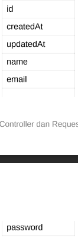<br /><br />
>2. Bersihkan isi User.php yang ada sebelumnya dan isi dengan baris kode berikut<br /><br />
>```javascript
><?php
>namespace App\Models;
>use Illuminate\Database\Eloquent\Model;
>class User extends Model
>{
>    /**
>    * The attributes that are mass assignable.
>    *
>    * @var array
>    */
>    protected $fillable = [
>        'name', 'email', 'password'
>    ];
>    /**
>    * The attributes excluded from the model's JSON form.
>    *
>    * @var array
>    */
>    protected $hidden = [];
>}
>```
>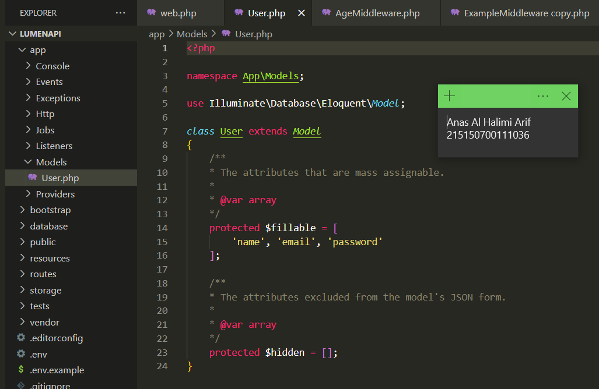<br /><br />
* ## Controller
>1. Buatlah salinan ExampleController.php pada folder app/Http/Controllers dengan nama HomeController.php dan buatlah fungsi index() yang berisi<br /><br />
>```javascript
><?php
>namespace App\Http\Controllers;
>class HomeController extends Controller
>{
>    /**
>    * Create a new controller instance.
>    *
>    * @return void
>    */
>    public function __construct()
>    {
>        //
>    }
>    // Pembuatan fungsi index() //
>    public function index()
>    {
>        return 'Hello, from lumen!';
>    }
>    // Pembuatan fungsi index() //
>    //
>}
>```
>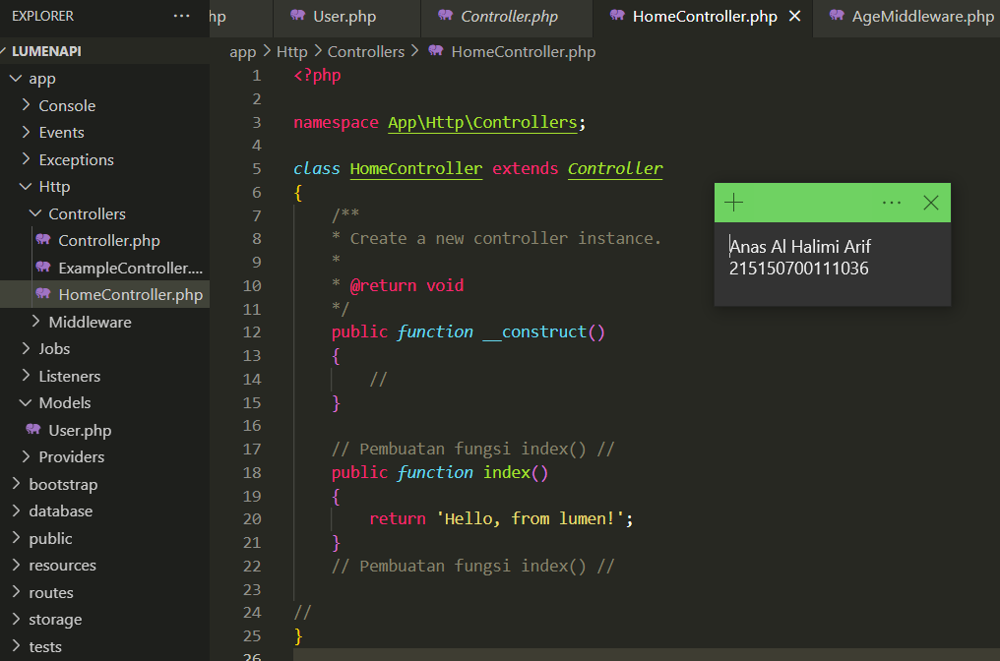<br /><br />
>2. Ubah route / pada file routes/web.php menjadi seperti ini<br /><br />
>```javascript
># Sebelum,
>$router->get('/', function () use ($router) {
>return $router->app->version();
>});
># Setelah,
>$router->get('/', ['uses' => 'HomeController@index']);
>```
>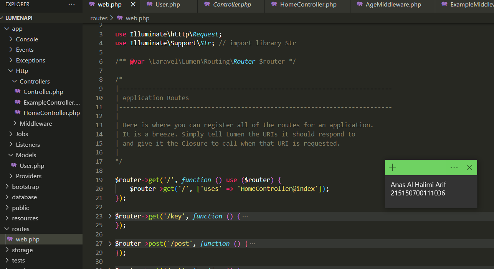<br /><br />
>3. Jalankan Aplikasi
>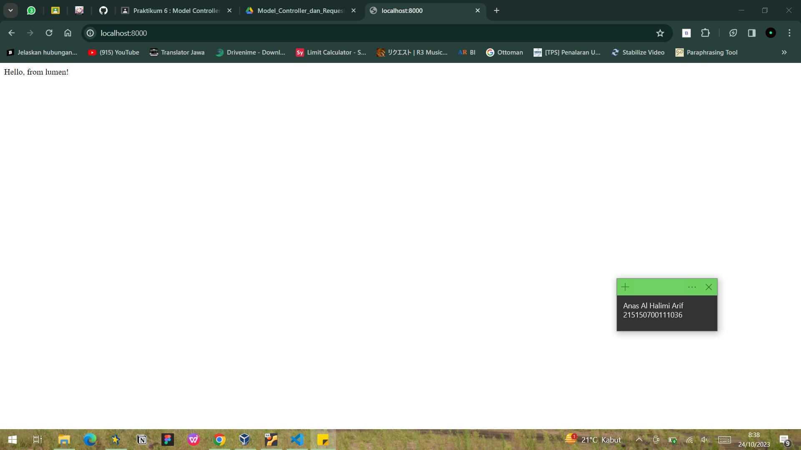<br /><br />
* ## Request Handler
>1. Lakukan import library Request dengan menambahkan baris berikut di bagian atas file <br /><br />
>```javascript
><?php
>namespace App\Http\Controllers;
>?// Import Library Request
>use Illuminate\Http\Request;
>```
>2. Ubah fungsi index menjadi <br /><br />
>```javascript
><?php
>namespace App\Http\Controllers;
>use Illuminate\Http\Request;
>class HomeController extends Controller
>{
>    /**
>    * Create a new controller instance.
>    *
>    * @return void
>    */
>    public function __construct()
>    {
>    //
>    }
>    // Perubahan fungsi index
>    public function index (Request $request)
>    {
>    return 'Hello, from lumen! We got your request from endpoint: ' . $request->path();
>    }
>    // Perubahan fungsi index
>    //
>}
>```
>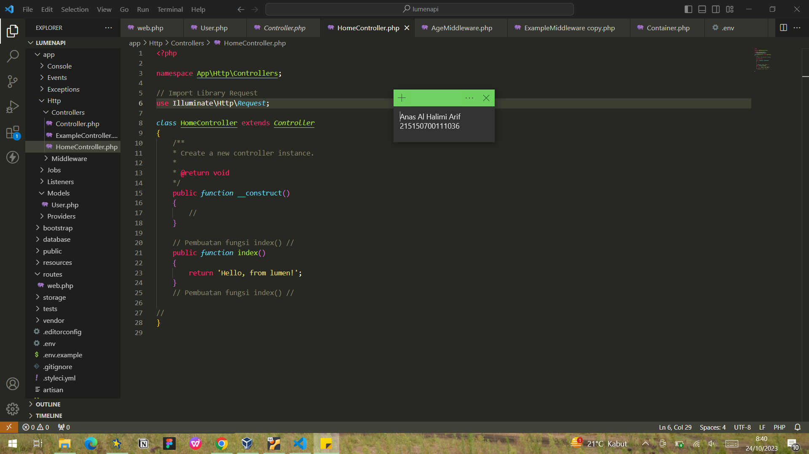<br /><br />
>3. Jalankan aplikasi
>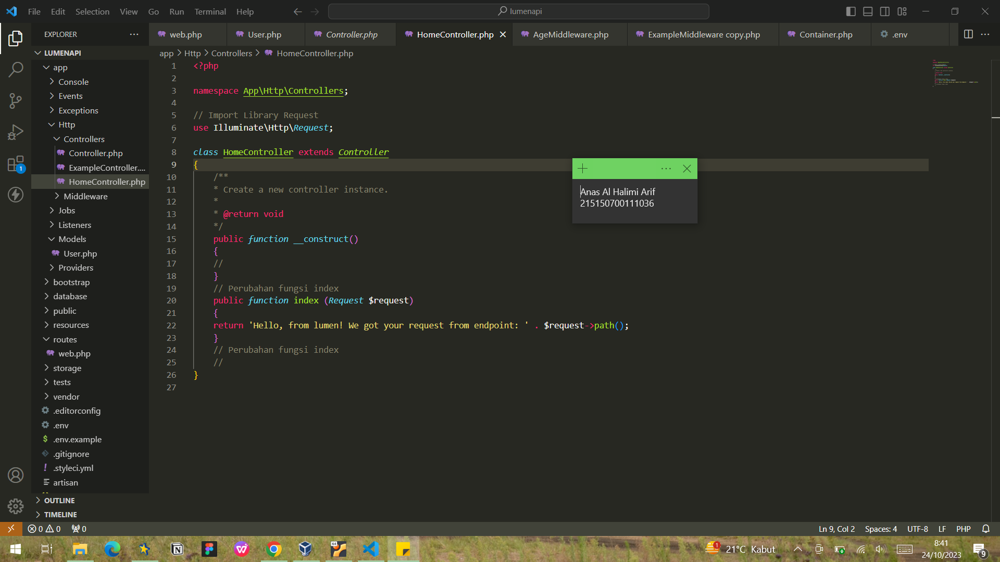<br /><br />
* ## Aliases Route
>1. Lakukan import library Response dengan menambahkan baris berikut di bagian atas file<br /><br />
>```javascript
><?php
>namespace App\Http\Controllers;
>use Illuminate\Http\Request;
>use Illuminate\Http\Response; // import library Response
>```
>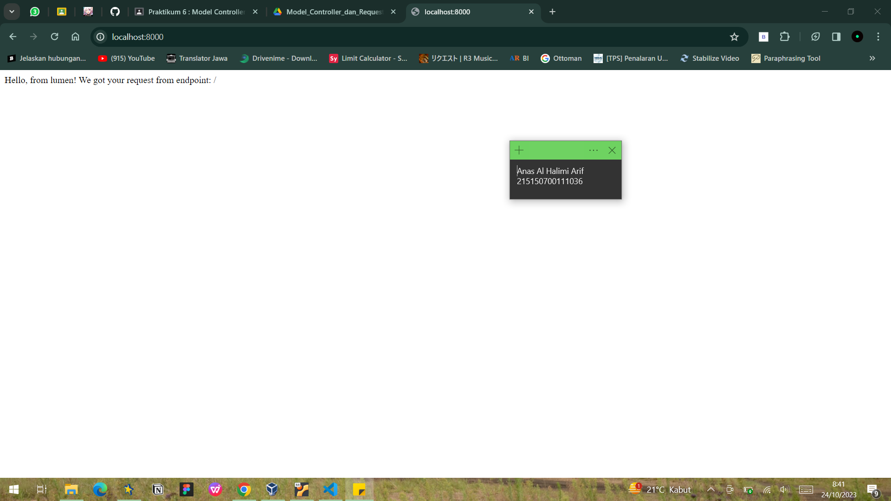<br /><br />
>2. Buatlah fungsi hello() yang berisi<br /><br />
>```javascript
><?php
>namespace App\Http\Controllers;
>use Illuminate\Http\Request;
>use Illuminate\Http\Response;
>class HomeController extends Controller
>    {
>    /**
>    * Create a new controller instance.
>    *
>    * @return void
>    */
>    public function __construct()
>    {
>        //
>    }
>    public function index (Request $request)
>    {
>    return 'Hello, from lumen! We got your request from endpoint: ' . $request->path();
>    }
>    //
>    // Pembuatan fungsi hello
>    public function hello()
>    {
>    $data['status'] = 'Success';
>    $data['message'] = 'Hello, from lumen!';
>    return (new Response($data, 201))
>        ->header('Content-Type', 'application/json');
>    }
>}
>```
>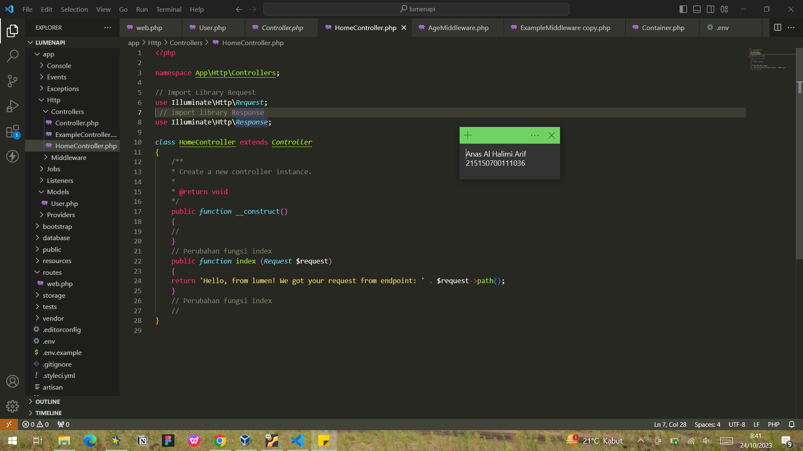<br /><br />
>3. Tambahkan route /hello pada file routes/web.php<br /><br />
>```javascript
><?php
>$router->get('/', ['uses' => 'HomeController@index']);
>$router->get('/hello', ['uses' => 'HomeController@hello']); // route hello
>```
>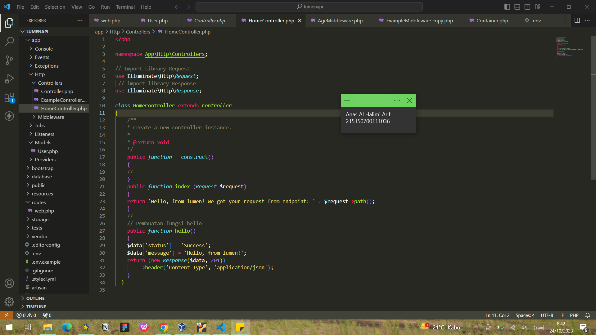<br /><br />
>4. Jalankan aplikasi pada route /hello<br /><br />
>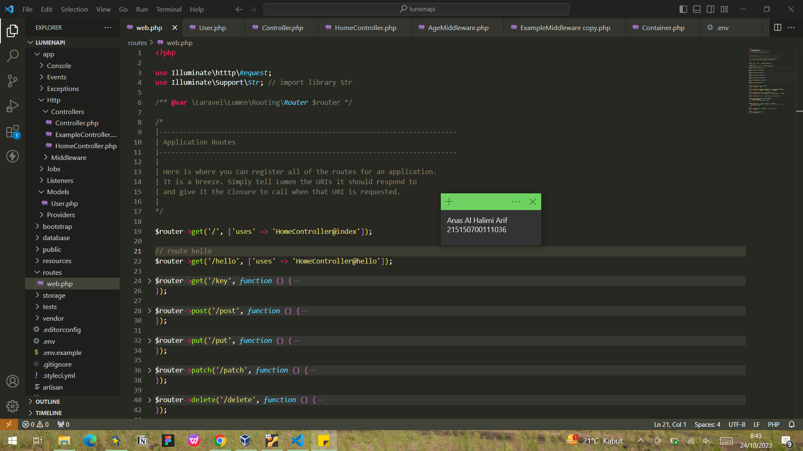<br /><br /
* ## Penerapam
>1. Lakukan import model User dengan menambahkan baris berikut di bagian atas file<br /><br />
>```javascript
><?php
>namespace App\Http\Controllers;
>use App\Models\User; // import model User
>use Illuminate\Http\Request;
>use Illuminate\Http\Response;
>```
>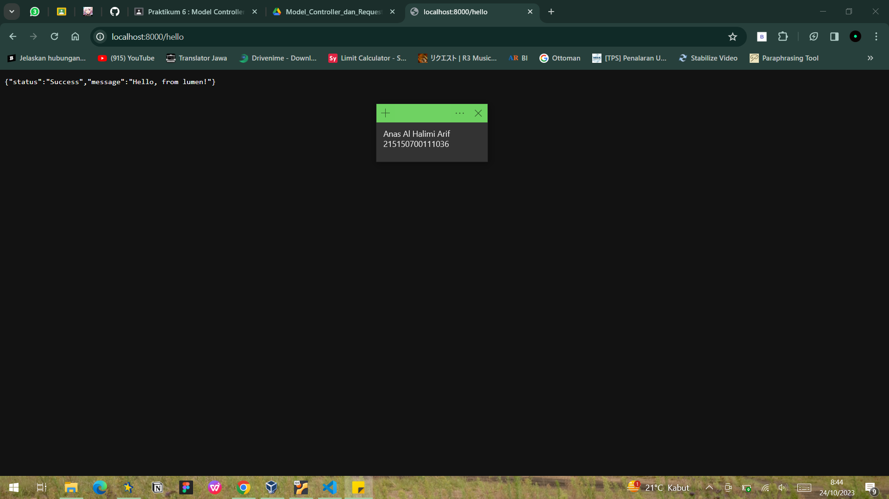<br /><br />
>2. Tambahkan ketiga fungsi berikut di HomeController.php<br /><br />
>```javascript
><?php
>namespace App\Http\Controllers;
>use App\Models\User; // import model User
>use Illuminate\Http\Request;
>use Illuminate\Http\Response;
>class HomeController extends Controller
>    {
>    ...
>    // Tiga Fungsi
>    public function defaultUser()
>    {
>        $user = User::create([
>            'name' => 'Nahida',
>            'email' => 'nahida@akademiya.ac.id',
>            'password' => 'smol'
>        ]);
>        return response()->json([
>            'status' => 'Success',
>            'message' => 'default user created',
>            'data' => [
>                'user' => $user,
>            ]
>        ],200);
>    }
>    public function createUser(Request $request)
>    {
>        $name = $request->name;
>        $email = $request->email;
>        $password = $request->password;
>        $user = User::create([
>            'name' => $name,
>            'email' => $email,
>            'password' => $password
>        ]);
>    return response()->json([
>            'status' => 'Success',
>            'message' => 'new user created',
>            'data' => [
>                'user' => $user,
>            ]`
>        ],200);
>    }
>    public function getUsers()
>    {
>        $users = User::all();
>        return response()->json([
>            'status' => 'Success',
>            'message' => 'all users grabbed',
>            'data' => [
>                'users' => $users,
>            ]
>        ],200);
>    }
>    // Tiga Fungsi
>}
>```
>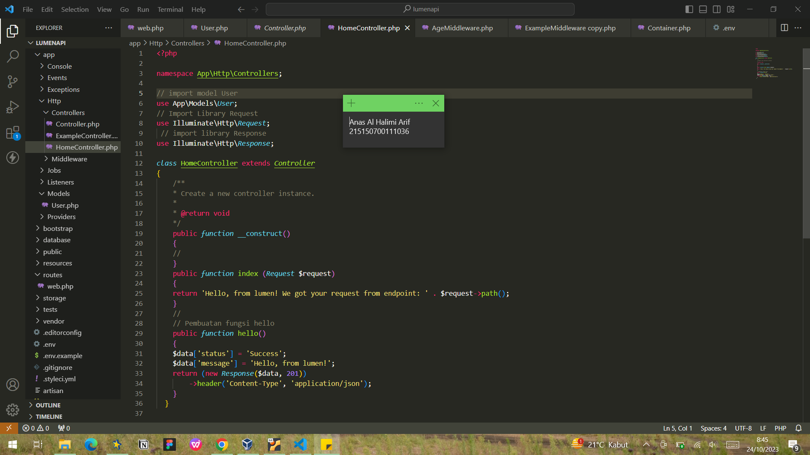<br /><br />
>3. Tambahkan ketiga route pada file routes/web.php menggunakan group route<br /><br />
>```javascript
>$router->get('/', ['uses' => 'HomeController@index']);
>$router->get('/hello', ['uses' => 'HomeController@hello']);
>// Tiga Route
>$router->group(['prefix' => 'users'], function () use ($router) {
>    $router->post('/default', ['uses' => 'HomeController@defaultUser']);
>    $router->post('/new', ['uses' => 'HomeController@createUser']);
>    $router->get('/all', ['uses' => 'HomeController@getUsers']);
>});
>```
>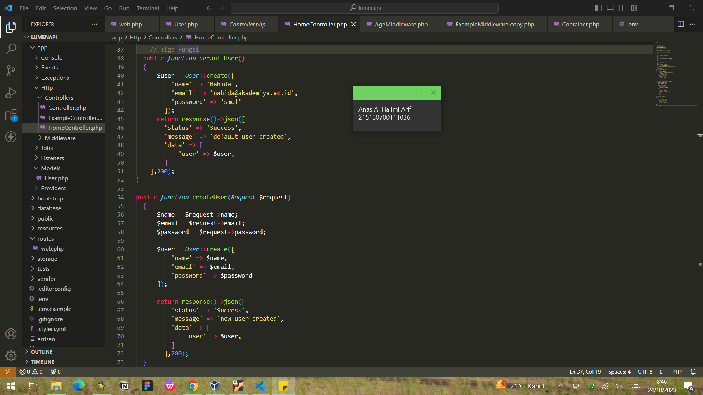<br /><br />
>4. Jalankan aplikasi pada route /users/default menggunakan Postman<br /><br />
>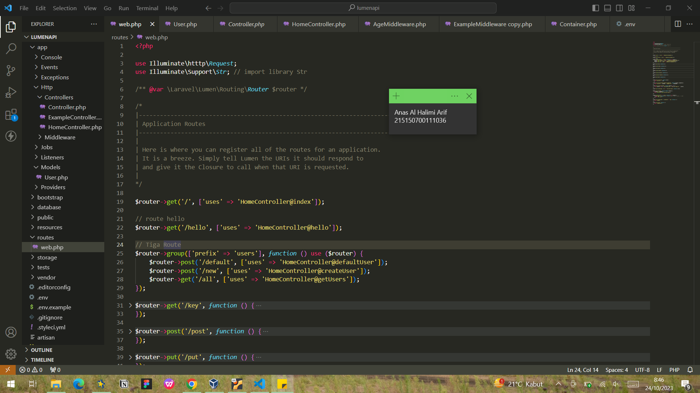<br /><br />
>5. Jalankan aplikasi pada route /users/new dengan mengisi body sebagai berikut<br /><br />
>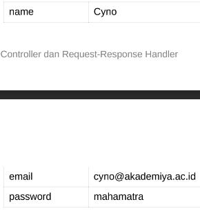<br /><br />
>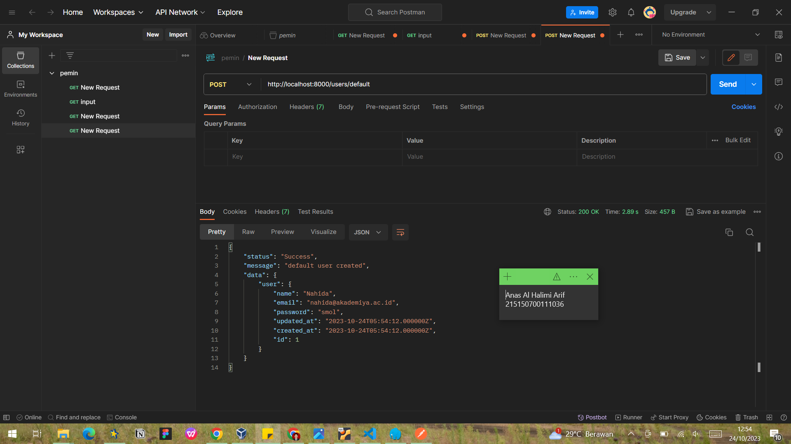<br /><br />
>6. Jalankan aplikasi pada route /users/all<br /><br />
>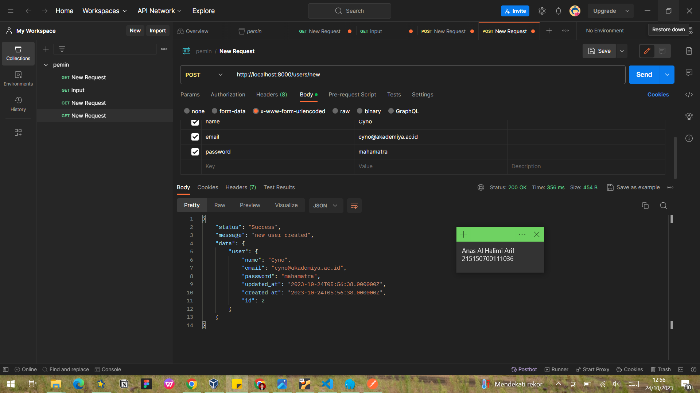<br /><br />