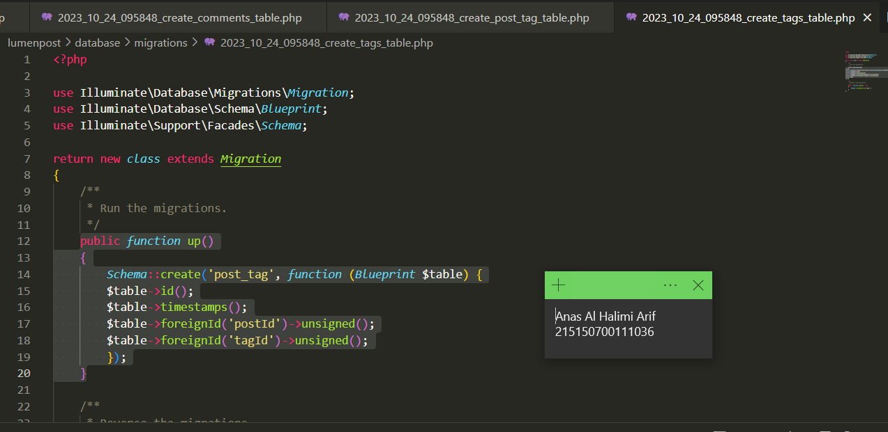

# Model, Controller dan Request-Response Handler

Anas Al Halimi Arif<br />
215150700111036<br />
PEMIN - A<br /><br />
 
* ## Pembuatan Tabel
>Berikut adalah tabel yang akan digunakan pada percobaan ini<br /><br />
><br /><br />
>1. Sebelum membuat migrasi database atau membuat tabel pastikan server database aktif kemudian pastikan sudah membuat database dengan nama ```lumenpost``` <br /><br />
><br /><br />
>2. Kemudian ubah konfigurasi database pada file .env menjadi seperti berikut <br /><br />
>```javascript
>DB_CONNECTION=mysql
>DB_HOST=127.0.0.1
>DB_PORT=3306
>DB_DATABASE=lumenpost
>DB_USERNAME=root
>DB_PASSWORD=
>```
><br /><br />
>3. Setelah mengubah konfigurasi pada file .env, kita juga perlu menghidupkan beberapa library bawaan dari lumen dengan membuka file app.php pada folder bootstrap dan mengubah baris ini <br /><br />
>```javascript
>// $app->withFacades();
>// $app->withEloquent();
>```
>menjadi
>```javascript
>$app->withFacades();
>$app->withEloquent();
>```
><br /><br />
>4. Setelah itu jalankan command berikut untuk membuat file migration <br /><br />
>```javascript
>php artisan make:migration create_posts_table
>php artisan make:migration create_comments_table
>php artisan make:migration create_tags_table
>php artisan make:migration create_post_tag_table
>```
><br /><br />
>5. Ubah fungsi ```up()``` pada file migrasi ```create_posts_table```<br /><br />
>```javascript
>#sebelumnya
>...
>public function up()
>    {
>        Schema::create('posts', function (Blueprint $table) {
>            $table->id();
>            $table->timestamps();
>        });
>    }
>    >...
>#diubah menjadi
>...
>public function up()
>    {
>        Schema::create('posts', function (Blueprint $table) {
>            $table->id();
>            $table->timestamps();
>            $table->string('content');
>        });
>    }
>...
>```
><br /><br />
>6. Ubah fungsi ```up()``` pada file ```create_comments_table``` <br /><br />
>```javascript
>#sebelumnya
>...
>public function up()
>    {
>        Schema::create('comments', function (Blueprint $table) {
>            $table->id();
>            $table->timestamps();
>        });
>    }
>...
>#diubah menjadi
>...
>public function up()
>    {
>        Schema::create('comments', function (Blueprint $table) {
>            $table->id();
>            $table->timestamps();
>            $table->string('review');
>            $table->foreignId('postId')->unsigned();
>        });
>    }
>...
>```
><br /><br />
>7. Ubah fungsi ```up()``` pada file ```create_tags_table``` <br /><br />
>```javascript
>#sebelumnya
>...
>    public function up()
>    {
>        Schema::create('tags', function (Blueprint $table) {
>            $table->id();
>            $table->timestamps();
>        });
>    }
>...
>#diubah menjadi
>...
>public function up()
>    {
>        Schema::create('tags', function (Blueprint $table) {
>            $table->id();
>            $table->timestamps();
>            $table->string('name');
>        });
>    }
>...
>```
><br /><br />
>8. Ubah fungsi ```up()``` pada file ```create_post_tag_table``` <br /><br />
>```javascript
>#sebelumnya
>...
>public function up()
>    {
>        Schema::create('post_tag', function (Blueprint $table) {
>            $table->id();
>            $table->timestamps();
>        });
>    }
>...
>#diubah menjadi
>...
>public function up()
>    {
>        Schema::create('post_tag', function (Blueprint $table) {
>            $table->id();
>            $table->timestamps();
>            $table->foreignId('postId')->unsigned();
>            $table->foreignId('tagId')->unsigned();
>        });
>    }
>...
>```
><br /><br />
>9. Kemudian jalankan command<br /><br />
>```javascript
>php artisan migrate
>```
><br /><br />
* ## Pembuatan Model
>1. Buatlah file dengan nama Post.php dan isi dengan baris kode berikut <br /><br />
>```javascript
><?php
>namespace App\Models;
>use Illuminate\Database\Eloquent\Model;
>class Post extends Model
>{
>    /**
>    * The attributes that are mass assignable.
>    *
>    * @var string[]
>    */
>    protected $fillable = [
>        'content'
>    ];
>    /**
>    * The attributes excluded from the model's JSON form.
>    *
>    * @var string[]
>    */
>    protected $hidden = [];
>}
>```
><br /><br />
>2. Buatlah file dengan nama Comment.php dan isi dengan baris kode berikut <br /><br />
>```javascript
><?php
>namespace App\Models;
>use Illuminate\Database\Eloquent\Model;
>class Comment extends Model
>{
>    /**
>    * The attributes that are mass assignable.
>    *
>    * @var string[]
>    */
>    protected $fillable = [
>        'review'
>    ];
>    /**
>    * The attributes excluded from the model's JSON form.
>    *
>    * @var string[]
>    */
>    protected $hidden = [];
>}
>```
><br /><br />
>3. Buatlah file dengan nama Tag.php dan isi dengan baris kode berikut <br /><br />
>```javascript
><?php
>namespace App\Models;
>use Illuminate\Database\Eloquent\Model;
>class Tag extends Model
>{
>    /**
>    * The attributes that are mass assignable.
>    *
>    * @var string[]
>    */
>    protected $fillable = [
>        'name'
>    ];
>    /**
>    * The attributes excluded from the model's JSON form.
>    *
>    * @var string[]
>    */
>    protected $hidden = [];
>}
>```
><br /><br />
* ## Relasi One-to-Many
>1. Tambahkan fungsi ```comments()``` pada file ```Post.php``` <br /><br />
>```javascript
><?php
>namespace App\Models;
>use Illuminate\Database\Eloquent\Model;
>class Post extends Model
>{
>    ...
>    // fungsi comments
>    public function comments()
>    {
>        return $this->hasMany(Comment::class, 'postId');
>    }
>}
>```
><br /><br />
>2. Tambahkan fungsi ```post()``` dan atribut postId pada ```$fillable``` pada file ```Comment.php``` <br /><br />
>```javascript
><?php
>namespace App\Models;
>use Illuminate\Database\Eloquent\Model;
>class Comment extends Model
>{
>    ...
>    protected $fillable = [
>        'review',
>        'postId' // atribut postId
>    ];
>    /**
>    * The attributes excluded from the model's JSON form.
>    *
>    * @var string[]
>    */
>    protected $hidden = [];
>    public function post()
>    {
>        return $this->belongsTo(Post::class, 'postId');
>    }
>}
>```
><br /><br />
>3. Buatlah file ```PostController.php``` dan isilah dengan baris kode berikut <br /><br />
>```javascript
><?php
>namespace App\Http\Controllers;
>use App\Models\Post;
>use Illuminate\Http\Request;
>class PostController extends Controller
>{
>    /**
>    * Create a new controller instance.
>    *
>    * @return void
>    */
>    public function __construct()
>    {
>        //
>    }
>    //
>    public function createPost(Request $request)
>    {
>        $post = Post::create([
>            'content' => $request->content,
>        ]);
>        return response()->json([
>            'success' => true,
>            'message' => 'New post created',
>            'data' => [
>                'post' => $post
>            ]
>        ]);
>    }
>    public function getPostById(Request $request)
>    {
>        $post = Post::find($request->id);
>        return response()->json([
>           'success' => true,
>            'message' => 'All post grabbed',
>            'data' => [
>                'post' => [
>                    'id' => $post->id,
>                    'content' => $post->content,
>                    'comments' => $post->comments,
>                ]
>            ]
>        ]);
>    }
>}
>```
><br /><br />
>4. Buatlah file ```CommentController.php``` dan isilah dengan baris kode berikut <br /><br />
>```javascript
><?php
>namespace App\Http\Controllers;
>use App\Models\Comment;
>use Illuminate\Http\Request;
>class CommentController extends Controller
>{
>    /**
>    * Create a new controller instance.
>    *
>    * @return void
>    */
>    public function __construct()
>    {
>        //
>    }
>    //
>    public function createComment(Request $request)
>    {
>        $comment = Comment::create([
>            'review' => $request->review,
>            'postId' => $request->postId,
>        ]);
>    return response()->json([
>            'success' => true,
>            'message' => 'New comment created',
>            'data' => [
>                'comment' => $comment
>            ]
>        ]);
>    }
>}
>```
><br /><br />
>5. Tambahkan baris berikut pada ```routes/web.php``` <br /><br />
>```javascript
><?php
>...
>$router->group(['prefix' => 'posts'], function () use ($router) {
>    $router->post('/', ['uses' => 'PostController@createPost']);
>    $router->get('/{id}', ['uses' => 'PostController@getPostById']);
>});
>$router->group(['prefix' => 'comments'], function () use ($router) {
>    $router->post('/', ['uses' => 'CommentController@createComment']);
>});
>```
><br /><br />
>6. Buatlah satu post menggunakan Postman <br /><br />
><br /><br />
>7. Buatlah satu comment menggunakan Postman <br /><br />
><br /><br />
>8. Tampilkan post menggunakan Postman <br /><br />
><br /><br />
* ## Relasi Many-to-Many
>1. Tambahkan fungsi ```tags()``` pada file ```Post.php``` <br /><br />
>```javascript
><?php
>namespace App\Models;
>use Illuminate\Database\Eloquent\Model;
>class Post extends Model
>{
>    ...
>    public function tags()
>    {
>        return $this->belongsToMany(Tag::class, 'post_tag', 'postId', 'tagId');
>    }
>}
>```
><br /><br />
>2. Tambahkan fungsi ```posts()``` pada file ```Tag.php``` <br /><br />
>```javascript
><?php
>namespace App\Models;
>use Illuminate\Database\Eloquent\Model;
>class Tag extends Model
>{
>    ...
>    public function posts()
>    {
>        return $this->belongsToMany(Post::class, 'post_tag', 'tagId', 'postId');
>    }
>}
>```
><br /><br />
>3. Buatlah file ```TagController.php``` dan isilah dengan baris kode berikut <br /><br />
>```javascript
><?php
>namespace App\Http\Controllers;
>use App\Models\Tag;
>use Illuminate\Http\Request;
>class TagController extends Controller
>{
>    /**
>    * Create a new controller instance.
>    *
>    * @return void
>    */
>    public function __construct()
>    {
>        //
>    }
>    //
>    public function createTag(Request $request)
>    {
>        $tag = Tag::create([
>            'name' => $request->name
>        ]);
>        return response()->json([
>            'success' => true,
>            'message' => 'New tag created',
>            'data' => [
>                'tag' => $tag
>            ]
>        ]);
>    }
>}
>```
><br /><br />
>4. Tambahkan fungsi ```addTag``` dan response tags pada ```PostController.php``` <br /><br />
>```javascript
><?php
>namespace App\Http\Controllers;
>use App\Models\Post;
>use Illuminate\Http\Request;
>class PostController extends Controller
>{
>    ...
>    public function getPostById(Request $request)
>    {
>        $post = Post::find($request->id);
>        return response()->json([
>            'success' => true,
>            'message' => 'All post grabbed',
>            'data' => [
>                'post' => [
>                    'id' => $post->id,
>                    'content' => $post->content,
>                    'comments' => $post->comments,
>                    'tags' => $post->tags, //response tags
>                ]
>            ]
>        ]);
>    }
>    public function addTag(Request $request)
>    {
>        $post = Post::find($request->id);
>        $post->tags()->attach($request->tagId);
>        return response()->json([
>            'success' => true,
>            'message' => 'Tag added to post',
>        ]);
>    }
>}
>```
><br /><br />
>5. Tambahkan baris berikut pada ```routes/web.php``` <br /><br />
>```javascript
>$router->group(['prefix' => 'posts'], function () use ($router) {
>    $router->post('/', ['uses' => 'PostController@createPost']);
>    $router->get('/{id}', ['uses' => 'PostController@getPostById']);
>    $router->put('/{id}/tag/{tagId}', ['uses' => 'PostController@getPostById']); //
>});
>...
>$router->group(['prefix' => 'tags'], function () use ($router) {
>    $router->post('/', ['uses' => 'TagController@createTag']);
>});
>```
><br /><br />
>6. Buatlah satu tag menggunakan Postman <br /><br />
><br /><br />
>7. Tambahkan tag “jadul” pada post “disana engkau berdua” <br /><br />
><br /><br />
>8. Tampilkan post “disana engkau berdua” menggunakan Postman <br /><br />
><br /><br />
>9. Buatlah postingan “tanpamu apa artinya” menggunakan Postman <br /><br />
><br /><br />
>10. Tambahkan tag “jadul” pada postingan “tanpamu apa artinya” <br /><br />
><br /><br />
>11. Buatlah tag “lagu” menggunakan Postman <br /><br />
><br /><br />
>12. Tambahkan tag “lagu” pada postingan “tanpamu apa artinya” <br /><br />
><br /><br />